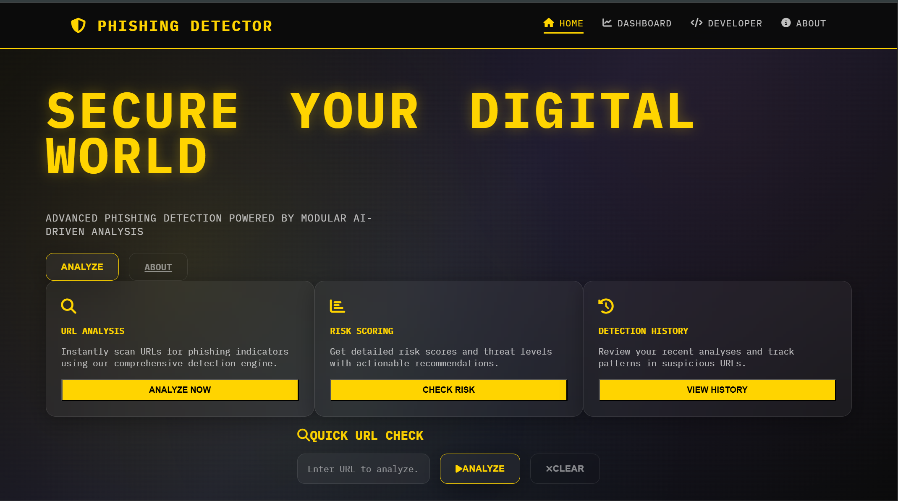
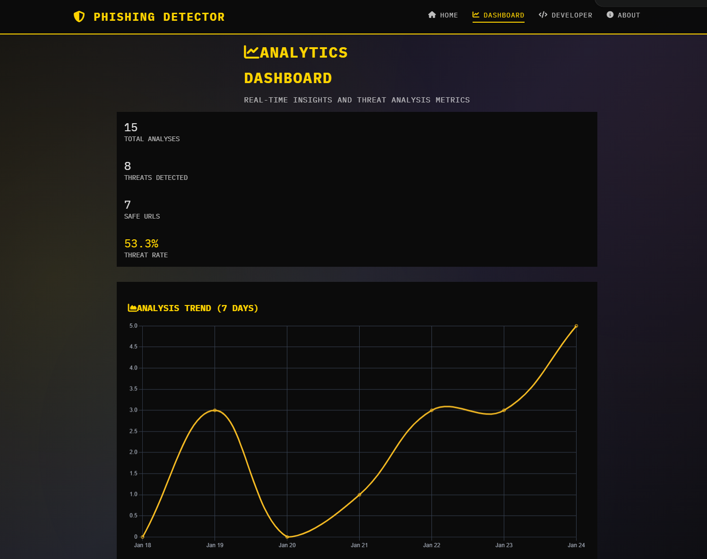
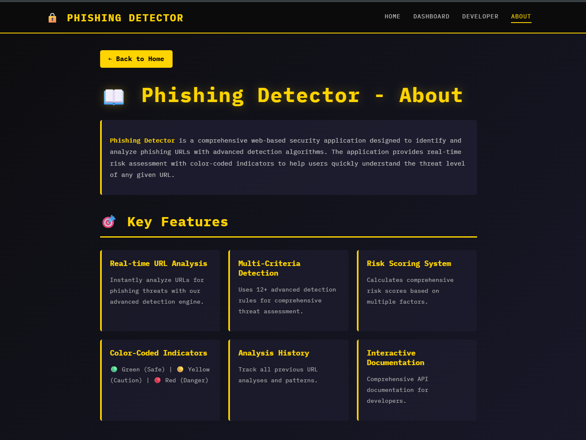

# Phishing Detector

**Stop Phishing Before It Strikes, Stay Secure**

[](https://openjdk.java.net/)
[](https://spring.io/projects/spring-boot)
[](https://maven.apache.org/)
[](https://opensource.org/licenses/MIT)

Phishing-Detector is a comprehensive security tool designed to detect potential phishing threats by analyzing URLs in real-time. Built with a modular architecture, it employs multiple detection rules to identify suspicious websites and provides detailed threat analysis with risk scoring.

## 🚀 Features

- **Real-time URL Analysis**: Instant threat detection with comprehensive risk scoring
- **Modular Detection Engine**: Easily extensible rules-based system for evolving threats
- **RESTful API**: Clean API endpoints for seamless integration
- **Interactive Dashboard**: Real-time analytics and threat monitoring
- **Threat Intelligence**: Optional integration with external threat databases
- **Detailed Reporting**: Structured analysis results with actionable insights
- **Security Best Practices**: Built-in security headers and rate limiting
- **Database Integration**: Persistent analysis history with H2/PostgreSQL support

## 📸 Screenshots

### 1. Landing Page

*Clean, intuitive interface for URL analysis*

### 2. URL Analysis Results

*Detailed threat analysis with risk breakdown*

### 3. Analytics Dashboard

*Real-time insights and threat metrics*

### 4. Developer API Documentation

*Interactive API documentation for developers*

### 5. Mobile Responsive Design

*Fully responsive design for all devices*

## 🛠️ Tech Stack

- **Backend**: Java 17+, Spring Boot 3.5+
- **Database**: H2 (dev) / PostgreSQL (prod)
- **Frontend**: HTML5, CSS3, JavaScript, Chart.js
- **Build Tool**: Maven
- **Security**: Spring Security
- **API**: RESTful with OpenAPI documentation

## 📋 Prerequisites

- **Java**: JDK 17 or higher
- **Maven**: 3.6 or higher
- **Git**: For cloning the repository

## 🚀 Quick Start

### 1. Clone the Repository
```bash
git clone https://github.com/your-username/phishing-detector.git
cd phishing-detector
```

### 2. Run with Maven Wrapper
```bash
# Windows
.\mvnw.cmd spring-boot:run

# Linux/macOS
./mvnw spring-boot:run
```

### 3. Access the Application
- **Web Interface**: http://localhost:8080
- **H2 Console**: http://localhost:8080/h2-console
- **API Documentation**: http://localhost:8080/developer.html

## 📖 Usage

### Web Interface
1. Navigate to http://localhost:8080
2. Enter a URL in the analysis form
3. Click "Analyze URL" to get instant results
4. View detailed threat analysis and risk score

### API Usage

#### Analyze a URL
```bash
curl -X POST http://localhost:8080/api/v1/phishing/analyze \
  -H "Content-Type: application/json" \
  -d '{"url": "https://example.com"}'
```

#### Get Analysis History
```bash
curl http://localhost:8080/api/v1/phishing/history
```

#### Get Dashboard Analytics
```bash
curl http://localhost:8080/api/v1/analytics/dashboard
```

## 🔧 Configuration

### Environment Variables
```bash
# Server Configuration
SERVER_PORT=8080

# Database (Production)
SPRING_DATASOURCE_URL=jdbc:postgresql://localhost:5432/phishing_detector
SPRING_DATASOURCE_USERNAME=your_username
SPRING_DATASOURCE_PASSWORD=your_password

# Security
ADMIN_PASSWORD=your_secure_password

# Threat Intelligence
THREAT_INTELLIGENCE_ENABLED=true
PHISHTANK_API_KEY=your_api_key
```

### Application Properties
Key configurations in `application.properties`:
- Database settings (H2 for dev, PostgreSQL for prod)
- Security configurations
- Threat intelligence settings
- Rate limiting parameters

## 🏗️ Project Structure

```
phishing-detector/
├── src/
│   ├── main/
│   │   ├── java/com/security/phishing_detector/
│   │   │   ├── controller/          # REST controllers
│   │   │   ├── domain/             # Entity classes
│   │   │   ├── dto/                # Data transfer objects
│   │   │   ├── repository/         # Data access layer
│   │   │   ├── service/            # Business logic
│   │   │   ├── security/           # Security configurations
│   │   │   ├── detection/          # Detection rules engine
│   │   │   └── PhishingDetectorApplication.java
│   │   └── resources/
│   │       ├── static/             # CSS, JS, images
│   │       ├── templates/          # Thymeleaf templates
│   │       └── application.properties
│   └── test/                       # Unit and integration tests
├── pom.xml                         # Maven configuration
├── mvnw & mvnw.cmd                 # Maven wrapper
├── Procfile                        # Heroku deployment
└── README.md
```

## 🧪 Testing

Run the test suite:
```bash
./mvnw test
```

Run with coverage:
```bash
./mvnw test jacoco:report
```

## 🚀 Deployment

### Heroku
1. Create a Heroku app
2. Set environment variables
3. Deploy using the Procfile

### Docker
```bash
# Build the image
docker build -t phishing-detector .

# Run the container
docker run -p 8080:8080 phishing-detector
```

### Traditional Server
```bash
# Build the JAR
./mvnw clean package -DskipTests

# Run the JAR
java -jar target/phishing-detector-0.0.1-SNAPSHOT.jar
```

## 📚 API Documentation

### Core Endpoints

| Method | Endpoint | Description |
|--------|----------|-------------|
| POST | `/api/v1/phishing/analyze` | Analyze a URL for threats |
| GET | `/api/v1/phishing/history` | Get analysis history |
| GET | `/api/v1/analytics/dashboard` | Get dashboard analytics |
| GET | `/api/v1/phishing/health` | Health check |

### Request/Response Examples

**URL Analysis Request:**
```json
{
  "url": "https://suspicious-site.com"
}
```

**Analysis Response:**
```json
{
  "url": "https://suspicious-site.com",
  "phishing": true,
  "riskScore": 85.5,
  "riskLevel": "HIGH",
  "detectedThreats": [
    "Suspicious domain age",
    "SSL certificate issues"
  ],
  "recommendation": "Avoid accessing this URL"
}
```

## 🤝 Contributing

We welcome contributions! Please follow these steps:

1. Fork the repository
2. Create a feature branch (`git checkout -b feature/amazing-feature`)
3. Commit your changes (`git commit -m 'Add amazing feature'`)
4. Push to the branch (`git push origin feature/amazing-feature`)
5. Open a Pull Request

### Development Guidelines
- Follow Java coding standards
- Add unit tests for new features
- Update documentation
- Ensure all tests pass

## 📄 License

This project is licensed under the MIT License - see the [LICENSE](LICENSE) file for details.

## 🙏 Acknowledgments

- [OpenPhish](https://openphish.com/) for phishing data
- [OWASP](https://owasp.org/) for security guidelines
- [Spring Boot](https://spring.io/projects/spring-boot) for the framework
- All contributors and security researchers

## 📞 Support

- **Issues**: [GitHub Issues](https://github.com/your-username/phishing-detector/issues)
- **Discussions**: [GitHub Discussions](https://github.com/your-username/phishing-detector/discussions)
- **Email**: your-email@example.com

---

**Stay Safe Online! 🛡️**

*Built with ❤️ for cybersecurity*

---

## 📸 Adding Screenshots

To complete the README with visual documentation:

1. Take screenshots of your application in action
2. Save them in the `screenshots/` directory with these names:
   - `landing-page.png` - The main landing page
   - `analysis-results.png` - URL analysis results page
   - `analytics-dashboard.png` - The analytics dashboard
   - `developer-docs.png` - Developer/API documentation page
   - `mobile-responsive.png` - Mobile view of the application
3. Commit and push the images to your repository

The README will automatically reference these images once added.  
